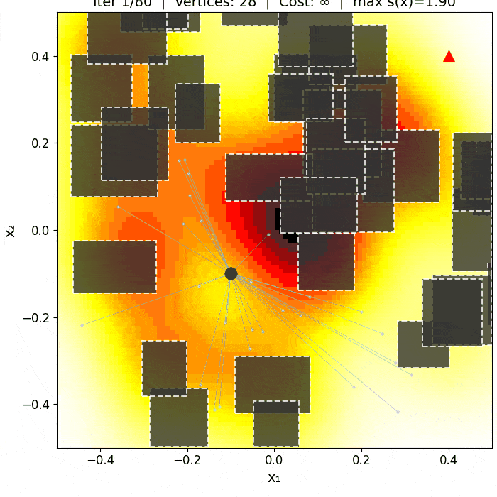
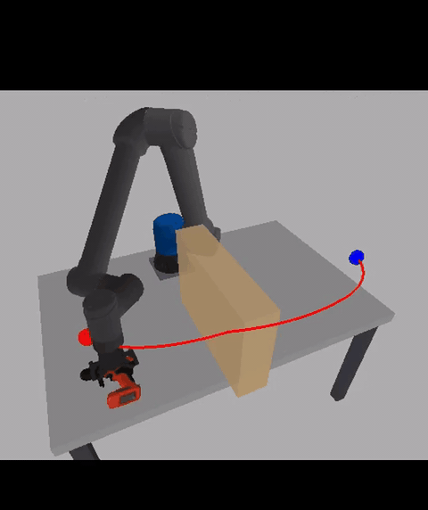
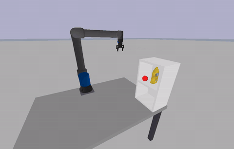
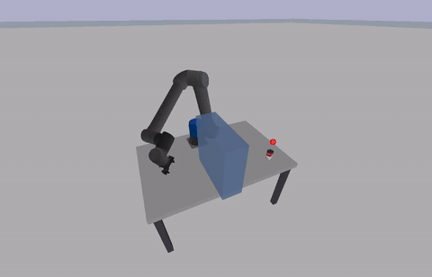
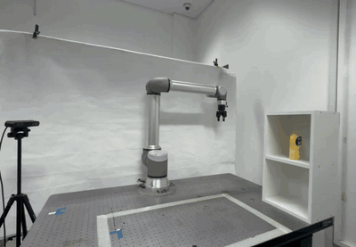
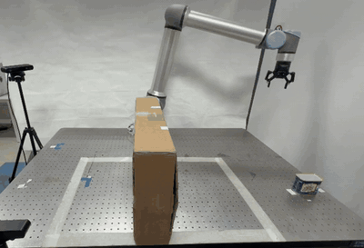
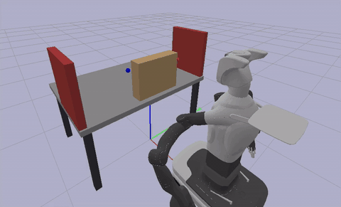

# RIT\* — Riemannian Informed Trees

**Cost-Adaptive Optimal Motion Planning with Riemannian Informed Sampling**

Reference implementation accompanying the IEEE RA-L paper:

> M. Ud Din, A. Nadar, J. Rosell, I. Hussain.
> **"RIT\*: Riemannian Informed Trees for Cost-Adaptive Optimal Motion Planning."**
> *IEEE Robotics and Automation Letters*, 2026.

<p align="center">
  
</p>

<table align="center">
  <tr>
    <td align="center" width="33%">
      <br/>
      <sub>UR10e – drill pick-and-place (sim)</sub>
    </td>
    <td align="center" width="33%">
      <br/>
      <sub>UR10e – shelf grasp (sim)</sub>
    </td>
    <td align="center" width="33%">
      <br/>
      <sub>UR10e – over-wall placement (sim)</sub>
    </td>
  </tr>
  <tr>
    <td align="center" width="33%">
      <br/>
      <sub>UR10e – shelf grasp (real robot)</sub>
    </td>
    <td align="center" width="33%">
      <br/>
      <sub>UR10e – over-wall placement (real robot)</sub>
    </td>
    <td align="center" width="33%">
      <br/>
      <sub>Tiago Pro – 14-DOF bimanual grasp</sub>
    </td>
  </tr>
</table>

---

## Abstract

We present **Riemannian Informed Trees (RIT\*)**, a planning framework that
replaces Euclidean primitives in batch-informed search with their Riemannian
counterparts. RIT\* constructs a tighter, cost-consistent informed set,
performs a nearest-neighbour search under an anisotropic distance metric, and
evaluates edge costs efficiently via a cascading scheme. We further introduce a
**Collision-Adaptive Metric Refinement (CARM)**, which learns an
obstacle-proximity cost field online from collision feedback, reducing the
reliance on prior metric design in practical settings.

Experiments across environments from 2-D to 14-D show that RIT\* is competitive
in low-dimensional and spatially constant-metric settings and produces
substantially lower-cost solutions when the metric varies spatially in
high-dimensional configuration spaces. Performance gains scale with anisotropy
and dimension, reaching up to **13.0 %** improvement in median initial cost
over BIT\* in the 3-D anisotropic benchmark, up to **9.0 %** in median final
cost in 6-DOF manipulation, and **24.8 – 63.5 %** in a 14-DOF bimanual planning
problem, where Euclidean-informed baselines degrade.

---

## Contributions

1. **Riemannian informed planning.** The informed set, nearest-neighbour
   search, and edge cost are all defined under a spatially varying metric
   tensor $G(x)$, focusing sampling on cost-relevant regions.
2. **Online proximity-aware metric refinement (CARM).** A collision-adaptive
   metric learned from planning feedback; no prior obstacle knowledge required.
3. **Comprehensive evaluation.** 2-D / 3-D benchmarks, 6-DOF UR10e
   manipulation (simulation and real robot), and 14-DOF Tiago Pro bimanual
   planning, compared against seven asymptotically optimal baselines.

---

## Citation

If you use RIT\* in your research, please cite:

```bibtex
@article{uddin2026rit,
  title   = {RIT*: Riemannian Informed Trees for Cost-Adaptive Optimal Motion Planning},
  author  = {Ud Din, Muhayy and Nadar, Ahmed and Rosell, Jan and Hussain, Irfan},
  journal = {IEEE Robotics and Automation Letters},
  year    = {2026}
}
```

---

## Installation

Requires Python ≥ 3.10.

```bash
git clone <repository-url> ritstar
cd ritstar

python3 -m venv .venv
source .venv/bin/activate           # Windows: .venv\Scripts\Activate.ps1
pip install -r requirements.txt
```

On Debian/Ubuntu, install `python3-venv` first if needed:

```bash
sudo apt install python3-venv python3-full
```

The `pybullet` dependency is only required for the 6-DOF / 14-DOF
manipulation demos.

---

## Quick Start

All entry-point scripts live at the repository root and read
[`config/run_config.yaml`](config/run_config.yaml) for their parameters.

| Command | Purpose |
| :--- | :--- |
| `python run_from_config.py`     | Reproduce Table II — full planner benchmark. |
| `python run_ablation.py`        | Reproduce Table III — RIT\* ablation study.  |
| `python run_benchmark_plots.py` | Reproduce Fig. 6 — success-rate / cost-vs-time plots. |
| `python run_carm_ral.py`        | Measure the CARM refinement overhead.         |
| `python run_2d_obstacle_demo.py`| Animated 2-D planning demo.                   |
| `python run_all.py`             | Run benchmark + ablation + plots sequentially.|

Outputs are written at runtime to `results/` (CSV, LaTeX tables) and
`visualization/` (PNG / PDF / GIF). Both directories are excluded from
version control and regenerated by the scripts on each run.

### Reproducing paper results

All paper tables (Table II – benchmark, Table III – ablation) and Fig. 6 are
regenerated by a single command:

```bash
python run_from_config.py
```

The planners, environments, trial count, and which artefacts to emit are
controlled by [`config/run_config.yaml`](config/run_config.yaml).

### Manipulator demos (PyBullet)

Interactive UR10e and Tiago Pro demos live under
[`manipulation/`](manipulation/):

```bash
python manipulation/UR10_pick_place_drill.py
python manipulation/Tiago_pro_dual_grasp_box.py            # 14-DOF bimanual
python manipulation/Tiago_pro_dual_grasp_box.py --headless # no GUI
```

Set `run_pybullet_demos: true` in `config/run_config.yaml` to launch them from
the main runner.

---

## Programmatic Use

```python
from rit_star import RITStar
from rit_star.environments import env_2d_random_world

collision, _, metric, x_start, x_goal, bounds = env_2d_random_world()

planner = RITStar(
    x_start=x_start,
    x_goal=x_goal,
    c_space_bounds=bounds,
    collision_checker=collision,
    metric=metric,
    max_iterations=200,
    batch_size=100,
    adaptive_metric=True,   # CARM
    random_seed=42,
)

path, cost = planner.plan()
stats = planner.get_stats()
```

Key parameters:

| Parameter          | Description                                                | Default      |
| :----------------- | :--------------------------------------------------------- | :----------- |
| `max_iterations`   | Number of BIT\*-style batches                              | `200`        |
| `batch_size`       | Samples added per batch                                    | `100`        |
| `adaptive_metric`  | Enable Collision-Adaptive Metric Refinement (CARM)         | `True`       |
| `geodesic_tier`    | Geodesic approximation: `'diagonal'` or `'full'`           | `'diagonal'` |
| `random_seed`      | RNG seed for reproducibility                               | `42`         |

---

## Repository Layout

```
rit_star/              Core library (planners, metrics, informed sets)
  rit_star.py            RIT* planner
  baselines.py           BIT*, AIT*, EIT*, APT*, Informed RRT*, GA-RRT*
  metric.py              Riemannian metric tensors and CARM
  informed_set.py        Whitened / Euclidean informed sets
  geodesic.py            Geodesic-distance approximations
  metric_cache.py        L1/L2 cascading metric cache
  environments.py        2-D and 3-D benchmark environments
  ur10_envs.py           UR10 6-D C-space environments
  comparison.py          Multi-planner comparison utilities
  experiments.py         Experiment runners (theory + benchmarks)
  visualize.py           Planner visualisation helpers

manipulation/          PyBullet demo scripts (UR10e + Tiago Pro)
manipulator_env/       PyBullet environment wrapper and planner interface
visualization_util/    Figure-generation scripts for the paper
ycb_objects/           YCB object meshes used by the PyBullet scenes

config/run_config.yaml Benchmark configuration
assets/                Figures, GIFs, and videos used in the paper
paper/                 Accepted RA-L manuscript (PDF)
```

Runtime outputs (`results/` for CSV/LaTeX tables and `visualization/` for
plots and GIFs) are regenerated by the scripts on each run and are excluded
from version control.

---

## Configuration

The paper benchmark is driven entirely by
[`config/run_config.yaml`](config/run_config.yaml). Common toggles:

| Key                         | Purpose                                                   |
| :-------------------------- | :-------------------------------------------------------- |
| `planners`                  | Subset of planners to run (or `all`).                     |
| `environments`              | Subset of environments (by name, dimension, or `all`).    |
| `n_trials`                  | Monte-Carlo trials per (planner, environment).            |
| `max_iterations`            | Batch-informed iterations per planner run.                |
| `batch_size`                | Samples per batch.                                        |
| `run_benchmark_plots`       | Emit Fig. 6-style success-rate / cost-vs-time plots.      |
| `generate_benchmark_tables` | Emit Table II / III CSV + LaTeX + console tables.         |
| `run_ablation`              | Run the ablation study (Table III).                       |
| `run_pybullet_demos`        | Launch selected PyBullet demos in sequence.               |
| `save_image`, `save_gif`    | Persist per-run PNG / GIF artefacts.                      |

See the header of the YAML file for the full list of accepted planner and
environment names.

---

## License

Released under the [MIT License](LICENSE).

---

## Acknowledgments

This research was supported by the Center for Autonomous Robotic Systems,
Khalifa University (KU-CARS), through the project *“T2FS by Silal”*
(Project ID: KU-EXT-SILAL-2025-8475000023) and by Project PID2024-157729OB-I00
funded by MICIU/AEI/10.13039/501100011033/FEDER, UE.


